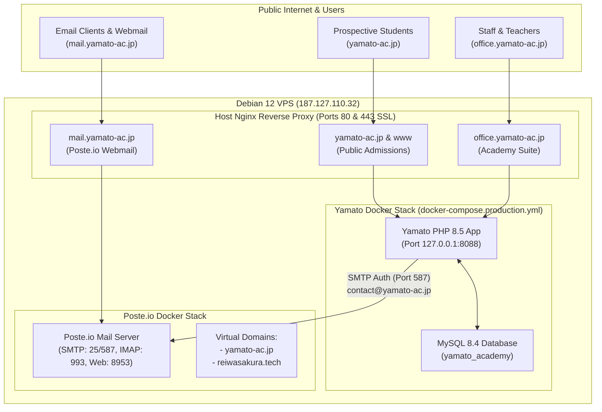

# Yamato Academy: Office Suite & Mail Server Integration Plan

**Target Domains**: `yamato-ac.jp` (Public Admissions) · `office.yamato-ac.jp` (Private Academy Suite) · `mail.yamato-ac.jp` (Poste.io Mail)  
**Host Server**: Debian 12 VPS (`187.127.110.32`)

---

## 1. Executive Summary & Unified Architecture

This plan connects the **Yamato Academy Application** (`../yamato/` running on Docker port `8088`) with the **Poste.io Mail Server** (`mail.reiwasakura.tech` / `mail.yamato-ac.jp`) and outlines key features to turn `office.yamato-ac.jp` into an enterprise-grade Japanese Language Academy & Sending Organization suite.



---

## 2. Mail Server Connection & Automation

### A. Environment Configuration (`.env.production`)
Add SMTP settings to `../yamato/.env.production`:

```dotenv
# Mail Server Integration (Poste.io)
MAIL_ENABLED=true
MAIL_HOST=mail.reiwasakura.tech
MAIL_PORT=587
MAIL_ENCRYPTION=tls
MAIL_USERNAME=contact@yamato-ac.jp
MAIL_PASSWORD=YourStrongPostePasswordHere
MAIL_FROM_ADDRESS=contact@yamato-ac.jp
MAIL_FROM_NAME="Yamato Academy"
MAIL_ADMISSIONS_ADDRESS=admissions@yamato-ac.jp
```

### B. Core Transactional Email Triggers
1. **Public Admissions Inquiries (`/contact`)**:
   - Automatically sends an instant notification to `admissions@yamato-ac.jp`.
   - Sends an immediate, personalized confirmation email to the student with Yamato's course booklet.
2. **Student Invoice & Payment Receipts (`office/invoices`)**:
   - One-click "Email Receipt" button sending a branded HTML/PDF invoice to `student['email']`.
3. **Staff Password Reset & Temporary Credentials**:
   - Sends temporary login credentials securely to the staff member's `@yamato-ac.jp` email.
4. **HR Leave Requests & Approval Notifications**:
   - Notifies supervisors when leave is requested; notifies staff when approved.

### C. Webmail Quick-Launch in Office Sidebar
Add a dedicated **`郵` Webmail** link in `office/partials/sidebar.php` pointing to `https://mail.yamato-ac.jp` with automatic tab opening.

---

## 3. Recommended High-Value Features for Yamato Office

### 1. Japan Immigration & Visa (COE) Tracker (在留資格・特定技能管理)
- **Why**: Japanese vocational schools and sending organizations need strict tracking of student visa applications (留学) and Specified Skilled Worker visas (特定技能).
- **Features**:
  - **COE Milestone Pipeline**: Document Preparation → Japanese Immigration Submission (出入国在留管理局) → COE Approval → Visa Stamped → Flight Date.
  - **Expiry & Document Alerts**: Passport validity, COE expiration, and medical checkup renewal warnings.

### 2. Japanese Standard Resume (JIS 履歴書) & Bio-Data Generator
- **Why**: Japanese interviewers require standardized Japanese-format resumes.
- **Features**:
  - Automatic conversion of student profile into formatted Japanese JIS 履歴書 (with Japanese imperial years 令和/平成, JLPT scores, Japanese name kanji/katakana, photo attachment).
  - Export to PDF and DOCX matching standard Japanese recruitment formats.

### 3. Student Attendance Rate Monitoring (出席率管理)
- **Why**: Japan Immigration requires language students to maintain **≥80% attendance** for visa renewal and job matching.
- **Features**:
  - 1-click mobile attendance taking for teachers (`出席` Present, `遅刻` Late, `欠席` Absent, `公欠` Excused).
  - Automatic warning badges when student attendance falls below 85%.

### 4. JLPT & JFT-Basic Test Scoring & Mock Exam Analytics
- **Features**:
  - Record mock test scores across N5, N4, N3, N2 levels (Vocabulary, Grammar, Reading, Listening).
  - Progress charts predicting student readiness for official JLPT exams.

### 5. Multi-Currency Finance & Sending Organization Fees (MMK / JPY)
- **Features**:
  - Dual-currency balance tracking (Tuition in MMK, Placement/Processing fees in JPY).
  - Payment installment schedules with payment reminder emails.

---

## 4. Immediate Development & Optimization Roadmap

| Phase | Milestone | Actions |
|---|---|---|
| **Phase 1 (Immediate)** | **DNS & Mail Integration** | Complete MuuMuu DNS fix (`s20260825401._domainkey`), verify SPF/DKIM/DMARC, configure SMTP in `core/mailer.php`. |
| **Phase 2** | **Nginx & SSL Live Deploy** | Run clean Nginx configuration with 500M body size and Let's Encrypt SSL for `yamato-ac.jp` and `office.yamato-ac.jp`. |
| **Phase 3** | **Automated Email Workflows** | Inquiries auto-reply, invoice PDF emailing, and staff leave notifications. |
| **Phase 4** | **Student Attendance & COE Pipeline** | Build daily class attendance taking and Japan visa milestone tracking. |
| **Phase 5** | **Japanese 履歴書 Generator** | Export JIS-standard Japanese resumes directly from student records. |
